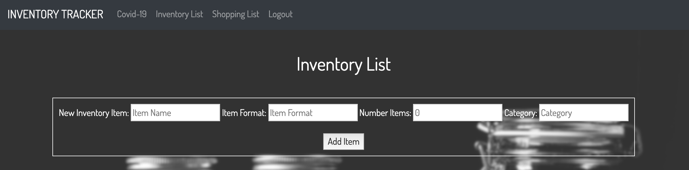
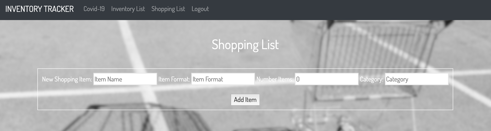

 

## Description

INVENTORY TRACKER- Simple and quick way to keep track of quantity of essential products you have on hand.

SHOPPING LIST- Easy to use shopping list generator.

## Table of Contents

* [Installation](#Installation) 

* [Technologies](#Technologies) 

* [Motivation](#Motivation)

* [Credits](#Credits)

* [Questions](#Questions)

## Motivation

This project was motivated by the global pandemic caused by Covid-19.  The threat of being quarantined and stores running out of essential products motivated us to create a quick and easy inventory tracker.  

## Installation

To install necessary dependencies, run the following command.

    npm install

## Technologies

    HTML/CSS/JAVASCRIPT/JQUERY/HANDLEBARS/NODE/EXPRESS/PASSPORT/MYSQL

    
 
## Credits

Credit to <a href="https://www.funches.org/">Martin Funches</a> && <a href="https://github.com/stephdedios">Stephanie De Dios</a> 

## Questions

 <a href="https://vartanyane.github.io/portfolioFinal/">If you have any questions please contact me</a>